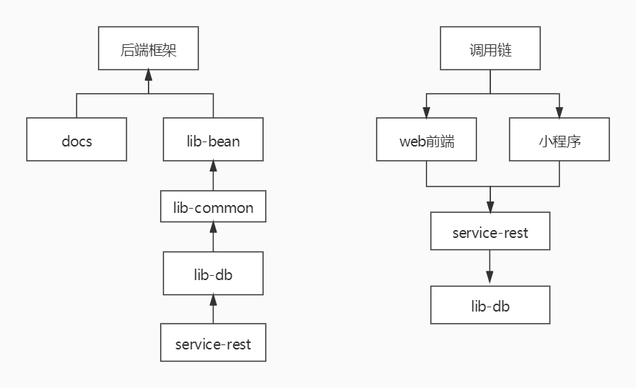

##基于区块链医疗助手
docs: 文档目录:存放sql脚本,文档,模板,插件等
lib-bean: Bean应用:存放entity,vo,dto
lib-common: 通用应用:存放常量,工具类,日志类,异常处理类
lib-db: 持久层应用:mapper层,不写service代码
service-rest: rest服务, 暂时只有一个

##架构图

##部署后端步骤
1. 修改数据库连接
使用com.hnu.blockchainlab.medicalassistants.libdb.test.EncryptPwdTest.encryptStr()方法生成数据库连接参数 
记下randomKey   
修改application-dev.yml数据库连接参数
2. 创建数据库medicalassistants,然后执行docs/db/init.sql脚本
3. 在Program arguments添加--mpw.key=randomKey
4. 运行RestApplication.main()方法
5. 访问http://localhost:7000/medicalassistants/rest/swagger-ui.html
6. 部署完成

##相关能力
1. mybatis-plus代码自动生成
   com.hnu.blockchainlab.medicalassistants.libdb.codegenerator.MyBatisPlusCodeGenerator.main
2. 登陆filter和配置白名单
   com.hnu.blockchainlab.medicalassistants.servicerest.filter.AuthFilter
3. swagger接口说明书
4. 全局异常处理
   com.hnu.blockchainlab.medicalassistants.libcommon.exception.GlobalExceptionHandler